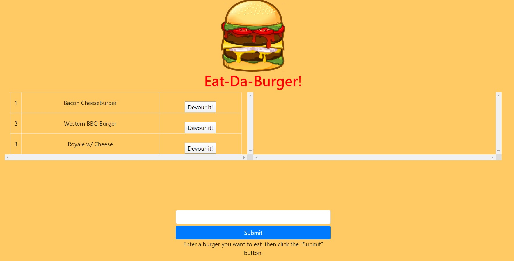
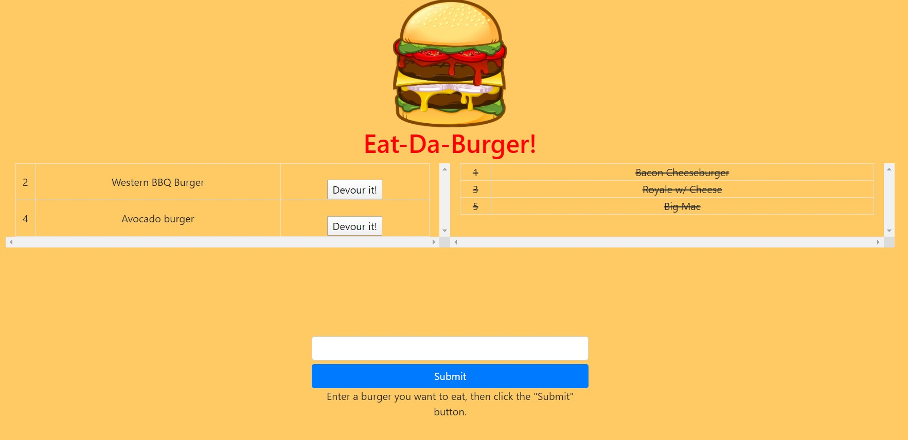
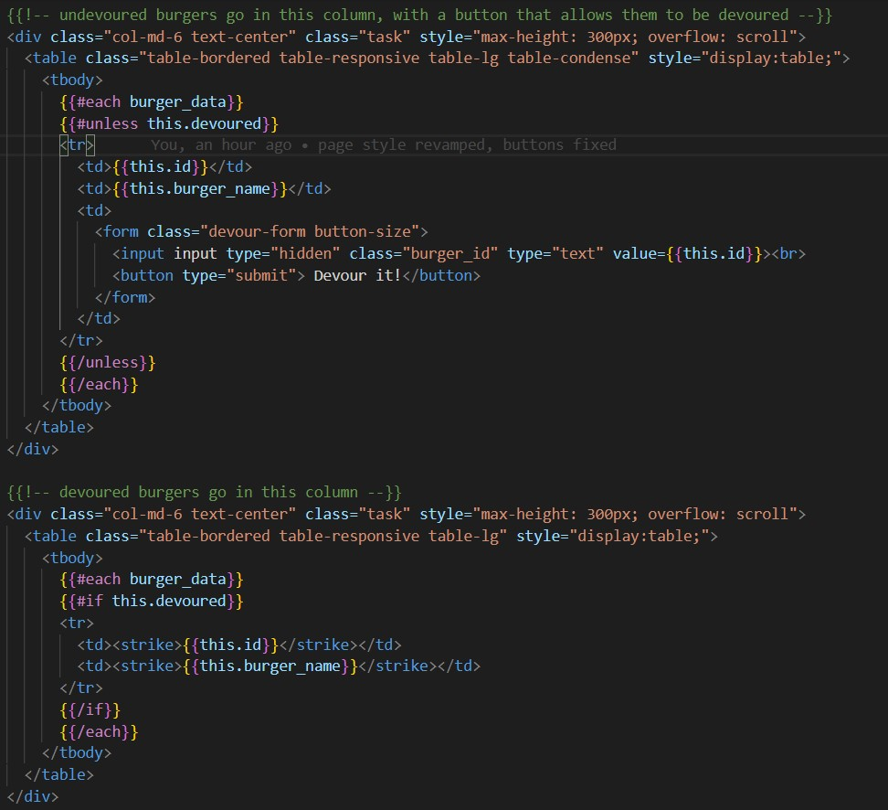

# 13th-homework
## Description

This is a simple application that allows a user to write down the names of burgers they would like to eat, then to "devour" that burger.

## Features

- Clean & simple user interface
- Web hosted database that updates dynamically & persists 

## Links

Deployed application deployed on Heroku: [https://evening-dawn-42448.herokuapp.com/burgers](https://evening-dawn-42448.herokuapp.com/burgers)

GitHub repository: [https://github.com/SamSherrill/13th-homework](https://github.com/SamSherrill/13th-homework)

## Usage

1. Simply open the link above to ask the deployed application 
2. Type in the name of any burger you'd like to eat, then click submit
3. Click the "Devour it" button to eat that burger 

## Screenshots

Example of app at start up with seed data loaded: 

Example of app with new user entered data and some burgers eaten: 

Example of code from index.handlebars: 

## Credits

- The directions from the homework had a straightforward walkthrough of how to create the initial MVC file structure, as well as suggestions of what focus of each file should be.
- The CatsApp in-class activity had a heavy influence on the code base. However, some major adjustments were made, especially to what is displayed to the user.
- My tutor, Kunbile Abdi, [kunbile09@gmail.com](kunbile09@gmail.com). He helped me begin the UI overhaul, and helped with some troubleshooting.

---
© 2020 Sam Sherrill
